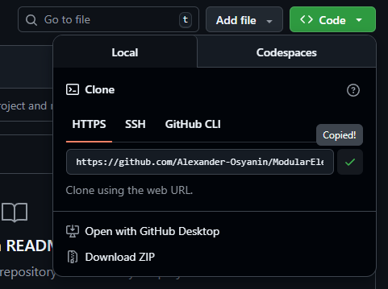
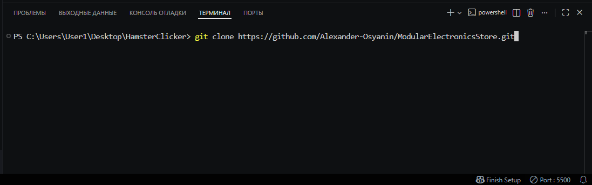
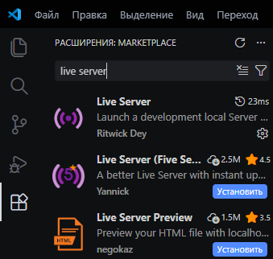
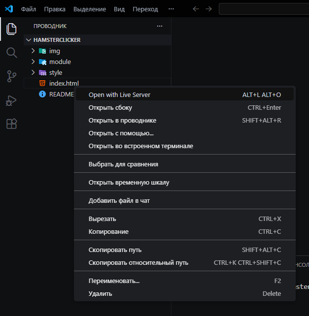

# Версия 1.0 - Базовый Кликер

## Задачи:
-	Кнопка для заработка монет
-	Счетчик монет
-	Система сохранения прогресса
-	Автоматическая загрузка сохраненного прогресса

## Инструкция по установке и запуску игры:

1. Заходите в репозиторий HamsterClicker

2. Нажимаете на зелёную кнопку "code" и там копируете ссылку на репозиторий

3. В терминале вашего редактора кода пишете команду `git clone https://github.com/Alexander-Osyanin/HamsterClicker`

4. В редакторе кода устанваливаете расширение по типу "Live Server" для открытия локального сервера

5. Нажимаете правой кнопкой мыши на файл `index.html`, Затем нажимаете на "Open with Live Server" 

Готово! Игра откроется в браузере установленном у вас по умолчанию.